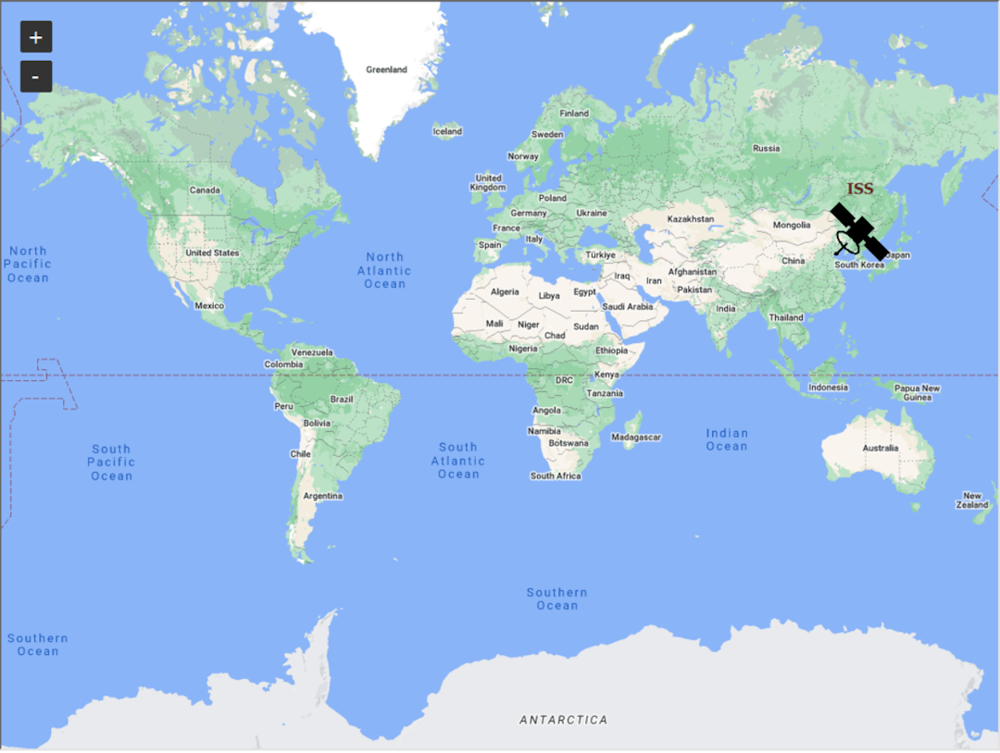
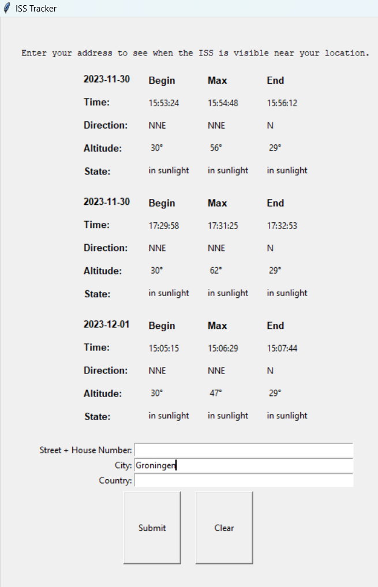

# ISS Tracker

ISS Tracker is a simple application that allows you to track the International Space Station (ISS)

## Features

- Real-time tracking of the ISS
- Display of ISS observation data for the next 10 days based on user location
- User-friendly interface with map visualization

## Screenshots

